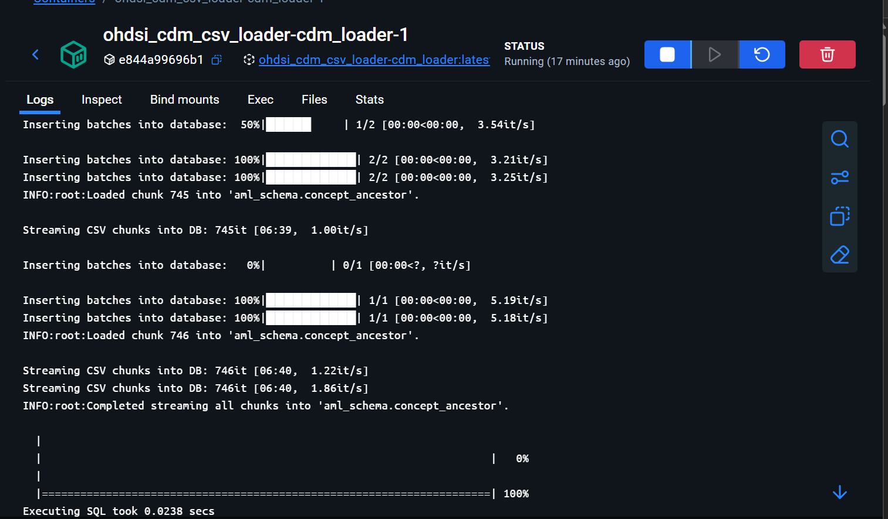
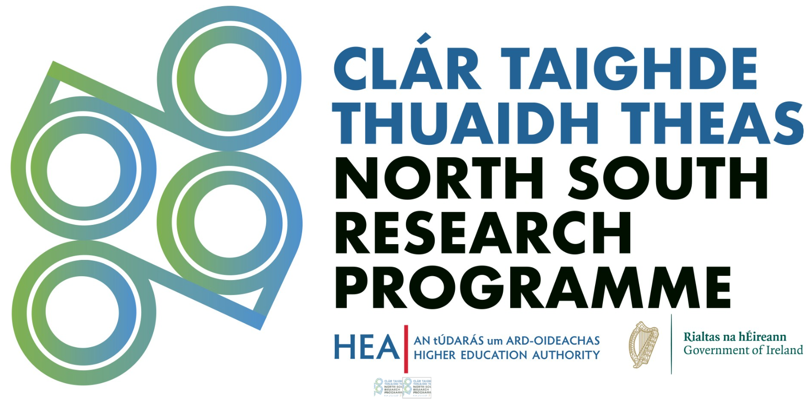

# 🎯OHDSI CDM Loader

The OHDSI CDM Vocabulary Loader is a lightweight, Dockerized container designed to load OHDSI Common Data Model (CDM) vocabularies ***version 5.4 or version 5.3*** into a PostgreSQL database. By leveraging `rpy2` for Python-R integration, it seamlessly utilizes OHDSI’s R packages (DatabaseConnector and SqlRender) within Python workflows, enabling efficient and reliable vocabulary loading. This tool is ideal for researchers, data scientists, and healthcare analysts working with the OHDSI CDM for observational health research.

We **strongly recommend** using the Docker setup to ensure a consistent environment, simplify dependency management, and avoid configuration conflicts.

## Repository Structure

```
ohdsicdm_loader/
├── db_connector.py  - Database connection helpers using R DatabaseConnector
├── load_csv.py      - Bulk load utilities for CSV files
├── __init__.py
driver/
main.py              - Example script showing how to run the loader
requirements.txt     - Python dependencies
launch.py            - call to docker container.
```

### `db_connector.py`
Defines `DatabaseHandler` which opens a connection to the database via R's `DatabaseConnector`.  It can execute DDL scripts, and run post‑load routines such as building indexes or loading events.

### `load_csv.py`
Contains `CSVLoader` for reading CSV or tab‑delimited files with pandas and inserting the rows in batches using `pg_bulk_loader`.

### `main.py`
Sample entry point that reads settings from environment variables, connects to the database and loads the vocabularies.

## Configuration

`main.py` relies on environment variables.  You can modify the codes here based on what you aim to achieve before running. These can be stored in a `.env` file
(a sample `.env.example` is provided):

```
DB_TYPE=postgresql
DB_SERVER=localhost
DB_PORT=5119
DB_NAME=aml_report
DB_USER=postgres
DB_PASSWORD=secret

# Host paths
HOST_DRIVER_PATH=C:/Users/23434813/Desktop/AML_data/ohdsi # This is optional.
HOST_CSV_PATH=C:/Users/23434813/Desktop/latest_vocabularies/vocabulary_download_v5_2
DB_SCHEMA=your_schema # optional. uses public if not set.

# Container paths-- Please do not edit these variables. Leave them this way!
DRIVER_PATH=/app/drivers
CSV_PATH=/app/vocabulary
```

- you can download the vocabularies from **[athena](https://athena.ohdsi.org/search-terms/start)**

## 💻 Usage
1. Install Docker (for Windows/macOS you can download **Docker Desktop** from
   [docker.com](https://www.docker.com/products/docker-desktop)).

2. Clone the repository using ```git clone https://github.com/eHealthHub4Cancer/ohdsi_cdm_loader.git```
3. Navigate to the project folder using ```cd ohdsi_cdm_loader```
4. Start the docker desktop you initially installed.
5. Ensure the environment variables described above are available in a `.env` file.
6. run the application using ```python launch.py```


The repository contains a `docker-compose.yml` for running the loader and a Postgres database in containers.

This convenience script runs `docker compose up -d --await`, once complete it shows a healthy state for the containers.

```bash
[+] Running 5/5
 ✔ cdm_loader                                   Built                                                                 0.0s 
 ✔ Network ohdsi_cdm_csv_loader_default         Created                                                               0.1s 
 ✔ Volume "ohdsi_cdm_csv_loader_postgres_data"  Created                                                               0.0s 
 ✔ Container ohdsi_cdm_csv_loader-db-1          Healthy                                                               6.9s 
 ✔ Container ohdsi_cdm_csv_loader-cdm_loader-1  Healthy                                                            1169.8s
 ```



If you prefer to run Compose manually simply execute `docker compose up -d --await`
instead.

## 💡 Next Steps

- Inspect `db_connector.py` and `load_csv.py` to see how Python and R work together.
- Tune the batch size and pool settings in `CSVLoader` for your database environment.
- Review the [OHDSI CDM documentation](https://ohdsi.github.io/CommonDataModel/) for schema details.

## 🏆 Credits 

This project is part of the [OHDSI](https://ohdsi.org) and was developed with support from the [eHealth Hub](https://ehealth4cancer.ie).

## 👥 Contributing

Contributions are very welcome! Feel free to open issues or pull requests if you have ideas for improvements or run into problems. The goal is to keep the loader simple and useful for anyone working with the OHDSI CDM.

## 🌟 Acknowledgement


